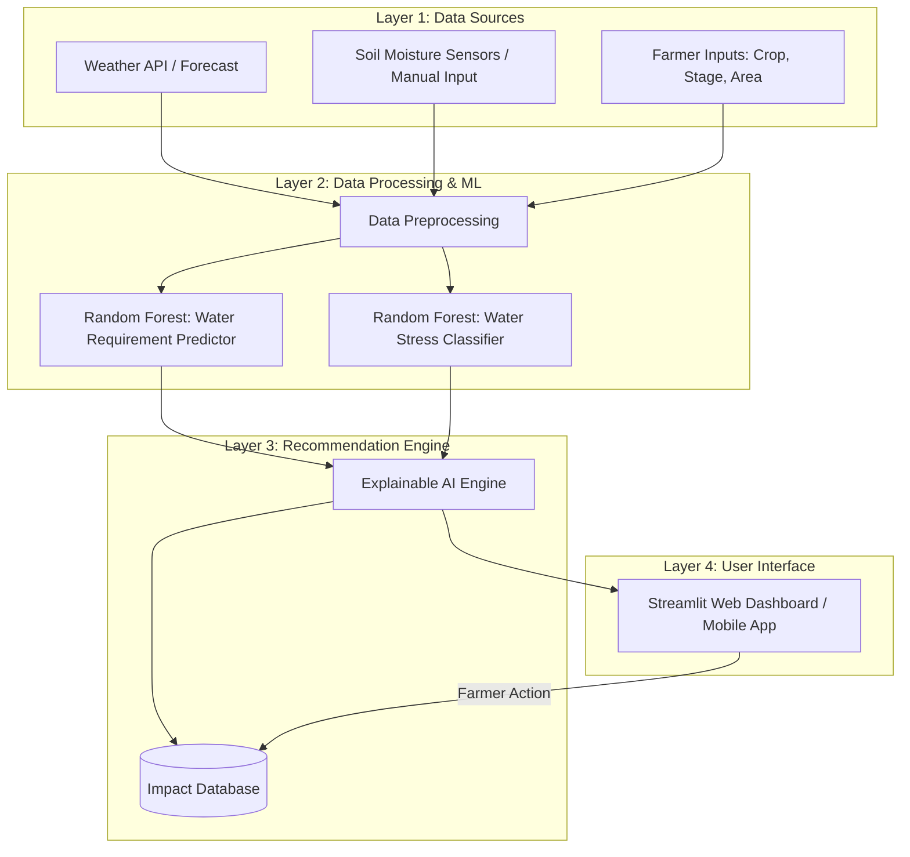

# System Architecture

The AquaSync AI platform is designed to be lightweight, scalable, and farmer-friendly.

## Layer Explanations
1. **Data Sources:** Accepts synthetic local climate data (temperature, humidity, rain forecast) and farm specs.
2. **ML Engine:** Uses Scikit-learn (Random Forest) to predict the exact `mm` of water required today and classifies the risk of drought stress.
3. **Recommendation Engine:** Translates raw ML outputs into plain-text advice (e.g., "Postpone irrigation, 15mm rain expected tomorrow").
4. **Dashboard:** A clean, metric-driven interface showing immediate ROI and environmental impact.
